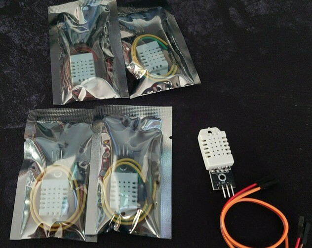

# Raspberry Pi Vivarium Monitor / Controller
Raspberry Pi Vivarium monitoring / control project.

## Introduction
I have 4 ball pythons and need to ensure the temperature and humidity are always at the right levels.  So this project is starting life as a sumple temperature/humidity sensor & recorder with web access, but over time could build up to include web-cams, temperature controller, over / under temperature alarms, door open sensors, you get the jist.

### A quick introduction to Pythons
Pythons (Python regius) are cold blooded reptiles originating from central Africa, which live in a vivarium (as it's normally too cold for in the UK) with a heater on one side (known as the warm side) and hides on both the warm and opposite side (the cool side). This warm / cold side provides a gradiated temperature shift between so allowing the snake to move freely between in order to regulate it's own temperature - Sir David Attenborough would be proud!

Snakes don't have eyelid, so need moisture in the air to protect their eyes, and keep them hydrated, at around 50% - 60% moisture content.

They are covered in overlapping scales which need to be shed approximately every 4-6 weeks, known as ecdysis.  End to end shedding cycles last about a week, and during this time it's best to have the moisture elevated (up to about 80% moisture), this aids in them shedding as the snake skin is moisturised.  If the moisture is fine, the skin comes off in one.  If the moisture is too low, the skin comes off in chunks in a "blow out".  If the shed is a blow out, you may need to intervene in order to remove any old skin which remains after the shed has completed.

As We need to measure the humidity across the vivarium and the temperature at both ends, we will need 2 sensors per vivarium - so by my maths, that's 8 temperature sensors (+ spares to replace any faulty ones).

[Wikipedia](https://en.wikipedia.org/wiki/Ball_python) has some good stuff on Pythons, if you fancy a read

## Components Required
The following components, and a little skill will be required, please note I get most of my stuff from [The Pi Hut](https://thepihut.com/collections/raspberry-pi-store) but other parts are available from other stores (I have listed some of them in the Appendix):
- [A Raspberry Pi](https://thepihut.com/collections/raspberry-pi/products/raspberry-pi-4-model-b) 
- [DHT11 or DHT22 (or equivalent) temp/humidity probe](https://www.amazon.co.uk/gp/product/B08HCHVC3W/)
- [Solderless Breadboard](https://www.amazon.co.uk/gp/product/B08V183BFJ/)
- [10K resistors](https://www.amazon.co.uk/gp/product/B091LYNNT5/)
- [wire](https://www.amazon.co.uk/gp/product/B07G72DRKC/)
- [IDC plugs/Crimping tool](https://www.amazon.co.uk/gp/product/B07VV3V6RP/)

To make things more permanent:
- soldering iron
- heat shrink

Depending on how many vivariums you want to monitor will denote the type of Raspberry Pi you'll need, I'm going for a Raspberry Pi 4, because I have a couple spare.

The DHT11 is a cheap sensor, but the DHT22 is more precise and will last longer, your call which one to opt for, there are others available and I found a quick [comparison site](https://kandrsmith.org/RJS/Misc/Hygrometers/calib_many.html) on other alternatives (warning - this site contains electronic tech speak).

# Equipment
So the first delivery has arrived, and I'm quite impressed with the quality for the price.

So before we go and start hooking all of this together, let's just explore the temp sensor.

# Temp/Humidity Sensor
The first step will be to connect a basic DHT11/DHT22 (from here on in I will just call them DHTs) to the Pi.

Connecting the sensor to the Raspberry Pi is quite simple as follows:

- DHT pin 1 (left) > 3.3v (pin 1)
- Connect the 10K resistor across pins 1 and 2 on the DHT
- DHT pin 2 > GPIO Pin 7
- DHT pin 3 - Not connected
- DHT pin 4 (right) > ground (pin 6) 

# Preparing the Raspberry Pi
Download and install selected OS of choice - I downloaded Ubuntu Server.

Login using ubuntu / ubuntu and change the password.

By default ubuntu server is not connected to Wifi, it should be using ethernet, but that's so old hat ;)

ls /sys/class/net - to find out the name of your device 'wlan0' is common.

      eth0   lo  wlan0

sudo nano /etc/netplan/50-cloud-init.yaml

add the following to the end (ensure indents are followed)

    wifis:
        wlan0:
            dhcp4: true
            optional: true
            access-points: 
                "[AccessPointSSID]":
                    password: "[AccessPointPassword]"

replacing [AccessPointSSID] and [AccessPointPassword] with the relevant details for your wifi

As always, you need to update and install Python (well, what other language would you use to monitor snakes?).

    sudo apt-get update
    sudo apt-get upgrade
    sudo apt-get install build-essential python-dev python-openssl git

In order to use the DHT we need to install some additional libraries

    sudo pip3 install adafruit-circuitpython-dht
    sudo apt-get install libgpiod2

# Source code
The source code for this is presently being developed - stay tuned.

# Appendix A - Shopping
Here are some stores to buy essentials from:

- [The Pi Hut](https://thepihut.com/collections/raspberry-pi-store) 
- [Pimori](https://shop.pimoroni.com/)
- [Amazon - of course](https://www.amazon.co.uk)
- [ebay](https://www.ebay.co.uk)

# Technical Resources and other stuff

[Probe semsor data comparison](https://kandrsmith.org/RJS/Misc/Hygrometers/calib_many.html) - note DHT22 is VERY similar to the AM2320, although the AM2320 is less accurate (2 - 3 deg C out and 5%-10% humidity out) - Also of interest is the fact that some of these devices can pull realtime data but their accuracy decreases over say 1s polling. For our requirements, 60s polling would be more than adequate, but if we perform 60 samples and then average it, this would be adequate as temp may drop if door is opened.

